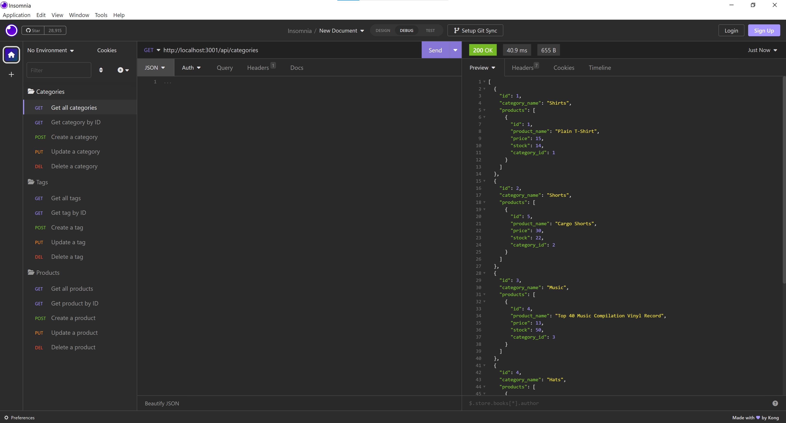

# E-Commerce Back End

## Description

This applicaiton aims to demonstrate how the back end of an e-commerce website functions. After setting up and connecting to sequelize, users will be able to make requests on the Insomnia app. This application supports the GET, POST, PUT, and DELETE requests that Insomnia offers. This application is important to create because companies must constantly update the back end of their websites so that they can remain relevant in the market.

## Screenshot of Back End in Insomnia

## Link to Walkthrough Video

https://drive.google.com/file/d/1yNNxjLfVaofBzd-2KMDLEgMXL6fe1tIg/view
